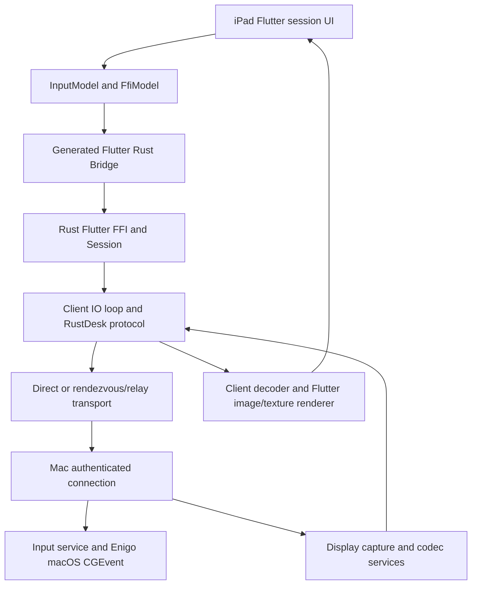

# Architecture audit of the pinned upstream

Base: `9f9585ce155a6558f0625eaf8fabfe8827c9a552`. This records existing source paths and proposed extension points. MacPilot product features are not implemented yet.

## Existing paths

| Concern | Components and flow |
| --- | --- |
| Video | `libs/scrap/src/quartz/`, `libs/scrap/src/common/quartz.rs` and ScreenCaptureKit capture → `src/server/video_service.rs` → `VideoFrame` in `libs/base/protos/message.proto` → `src/client/io_loop.rs` → decoder/video queue in `src/client.rs` → `src/flutter.rs` → `ImageModel`/texture rendering and mobile `remote_page.dart` |
| Pointer coordinates | Mobile gesture widgets → `InputModel.handlePointerEvent` / `handleMouse` / coordinate conversion → `session_send_mouse` in `src/flutter_ffi.rs` → Session and `MouseEvent` → host connection/input service → Enigo's macOS `CGEvent` path |
| Mouse buttons | `InputModel.sendMouse` and button masks → Rust input/session protocol → host `input_service.rs` → Enigo `mouse_down`/`mouse_up`, including distinct left/right/middle events |
| Scroll | InputModel pointer signals/gestures → mouse scroll events → host input service → macOS `CGEventCreateScrollWheelEvent`; preserve horizontal and vertical axes |
| Keys | `InputModel.handleKeyEvent` / `inputKey` → `session_input_key`, plus committed text through `session_input_string` → `KeyEvent` → host input service and `libs/base/src/keyboard.rs` → Enigo |
| Modifiers | `input_modifier_utils.dart` and InputModel modifier handlers → explicit Alt/Ctrl/Shift/Command flags → Session/Enigo CGEvent flags; release tracked keys at lifecycle boundaries |
| Clipboard | Mobile session currently invokes clipboard sync when foregrounded → `src/clipboard.rs`, client IO-loop clipboard handling and `src/server/clipboard_service.rs` → `Clipboard`/`MultiClipboards`; file clipboard support lives in `libs/clipboard` and is separate from non-file text/image formats |
| Files | `flutter/lib/models/file_model.dart` and mobile `file_manager_page.dart` → session FFI → `FileAction`/`FileResponse` → `src/client/file_trait.rs`, host connection and `libs/base/src/fs.rs` |
| Session state | `FfiModel` owns Flutter event dispatch/UI state; `src/flutter.rs` owns Rust Flutter sessions; `src/ui_session_interface.rs` owns connection-round state; `src/client/io_loop.rs` owns current transport activity |
| Authentication | Client login/session entry points → `LoginRequest` and host `src/server/connection.rs`; existing authorized-scope checks, login deadline and `src/server/login_failure_check.rs` must remain active |
| Unattended access | Existing host authentication/configuration and macOS `src/platform/macos.rs` service/LaunchDaemon/LaunchAgent handling; trust/revocation and Keychain suitability still require explicit audit before MacPilot persistence changes |
| Rendezvous/relay | `src/client.rs`, `src/rendezvous_mediator.rs`, shared `libs/hbb_common` rendezvous/socket infrastructure and client connection policy; reuse transport negotiation and encryption |
| Reconnect | Existing `FfiModel` retry timers and reconnect dialogs → `session_reconnect` → `Session::reconnect` in `src/ui_session_interface.rs`; connection rounds prevent stale connection activity from controlling a newer round |
| iOS integration | `flutter/ios/Runner/AppDelegate.swift` registers plugins and retains Rust symbols; the Xcode project links the Rust static archive. Mobile `remote_page.dart` currently owns software-keyboard focus/composition behavior |
| macOS integration | `src/platform/macos.rs`/`macos.mm`, Enigo and capture APIs; Flutter `MainFlutterWindow.swift` handles native platform channels, including existing relative-mouse support |
| Displays | `session_switch_display` / `session_change_resolution`, display metadata in FfiModel, `src/server/display_service.rs` and `SwitchDisplay` protocol messages; existing client model already restores a selected monitor after reconnect |
| Audio | `src/server/audio_service/` capture/encoder → protocol → client audio decode/playback modules; platform feature support must be checked on physical iPad, not inferred from protocol presence |
| Hardware codecs | `libs/scrap/src/common/codec.rs` and `hwcodec.rs`, pinned external `hwcodec`, vcpkg FFmpeg and `hwcodec`/`screencapturekit` features. Preserve negotiation/fallback; no promise that every preset has a hardware path |

## Extension boundaries

- Dashboard, onboarding, display/quality controls, tutorials and feature flags: new mobile/product widgets beside the existing pages, using existing peer/session/configuration models. Central branding must be isolated from low-level protocol names.
- Touch, virtual trackpad, hardware pointers, Pencil and modifier/accessory state: isolated input modules beside InputModel and existing mobile gesture widgets. Feature-off paths must call the existing implementation. Avoid a second session/input transport.
- Smart remote keyboard: a new macOS `input_context_monitor` in the platform module, attached after host authentication, with event-based AXObserver metadata classification. Do not read/transmit AX field values. Client-only protocol evolution belongs in `libs/base/protos/message.proto` where possible, using unused field numbers and capability gating. Consume the event through existing Rust Flutter event dispatch; retain the manual keyboard path in `remote_page.dart`. SDK and physical-device validation are still pending.
- Reconnect UI and input gating: extend existing connection-round/session events and Flutter state without creating competing reconnect timers or replaying queued input. Last-frame retention must reuse ImageModel/renderer ownership.
- Adaptive display quality: `src/server/video_qos.rs` already implements delayed recovery and FPS/bitrate adaptation. It has regression tests. Extend available metrics and presets rather than adding a second adaptive controller.
- Diagnostics: existing `QualityMonitorModel` carries speed, FPS, delay, target bitrate, codec and chroma. Distinguish measured values from absent observations. Host permission state is already exposed by platform APIs; create a redacted local export, never a frame/clipboard/keystroke export.
- Permissions, background service and wake: extend the macOS platform module and existing permission/service calls. Wake capabilities must be discovered; an Offline device cannot be made wake-capable by a UI label.
- Pairing/Keychain, clipboard Ask/Off defaults and revocation: audit existing Config/PeerConfig and authentication lifecycle before changing persistence. Do not place new secrets in Flutter preferences. Maintain host-session visibility and existing authentication limits.

The initial audit finds no existing AXObserver focused-editability monitor in the inspected macOS platform files. This is proposed new behavior, not a hidden upstream capability. Full feature-off/regression checks and physical acceptance remain part of later milestones.
